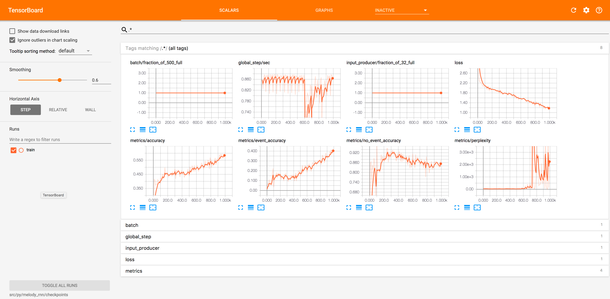

Do Androids Dream of EDM?
=========================

## A RubyKaigi Talk by Julian and Eric

### About
This talk/repo is about using a [recurrent neural network](https://en.wikipedia.org/wiki/Recurrent_neural_network) (in particular, an [LSTM](https://en.wikipedia.org/wiki/Long_short-term_memory)) to generate music from training MIDI files using [Tensorflow's Magenta project](https://github.com/tensorflow/magenta) and [Ruby](https://www.ruby-lang.org/en/).

## Dependencies
* [Python](https://www.python.org/) (2.x) + [Pip](https://pypi.python.org/pypi/pip)
* [Ruby](https://www.ruby-lang.org/en/) (2.4.) + [Bundler](http://bundler.io/)

## Installation
1. Install Python requirements (`$ pip install -r requirements.txt`). We recommend using [VirtualEnv](https://virtualenv.pypa.io/en/stable/) to manage your Python version(s) and dependencies.
2. Install Ruby requirements (`$ bundle`).

## Training and Generating Music
You can train and use the LSTM neural network as follows:

1. Place the training MIDI files in the `midi/` directory.
2. Change to the Ruby directory: `$ cd src/rb`.
3. Run the main Ruby file: `$ ruby main.rb`.

This will convert the MIDI files to a TFRecord file (which contains NoteSequence protocol buffers), create SequenceExamples from the TFRecord file, train the network on the data, and generate music from the resulting checkpoints. You can view the training and evaluation data via `$ tensorboard --logdir=src/py/melody_rnn/checkpoints`:

Generated music will be written to the `generated/` directory in the root of this project. We use timidity to listen to it: `$ brew install timidity && timidity path_to_your.midi`.

## Roadmap
- [x] Generate MIDI files using Magenta and Python.
- [x] Call into the Python code using the [rubypython gem](https://github.com/halostatue/rubypython) (this is currently _super_ minimal).
- [ ] Help extend [tensorflow.rb](https://github.com/somaticio/tensorflow.rb) to more seamlessly integrate Ruby + Magenta.
